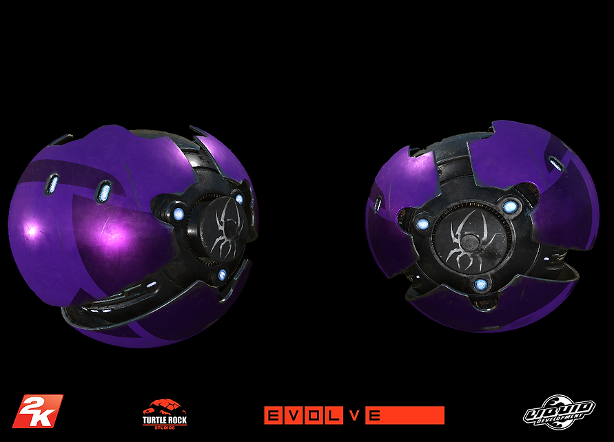
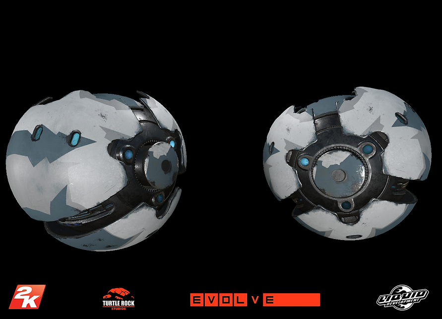
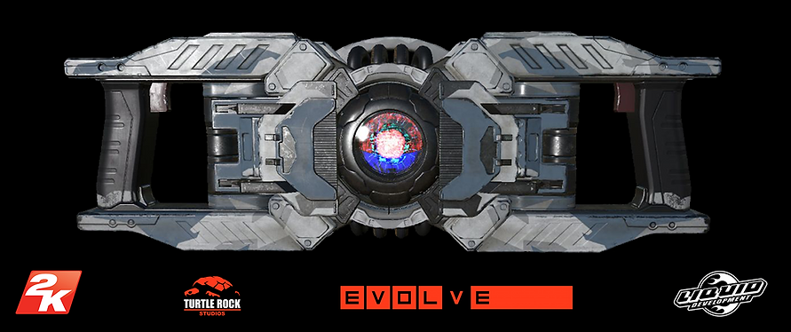
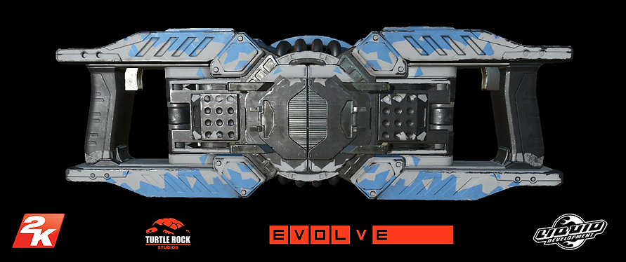
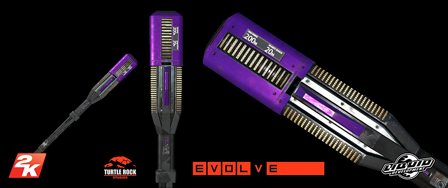
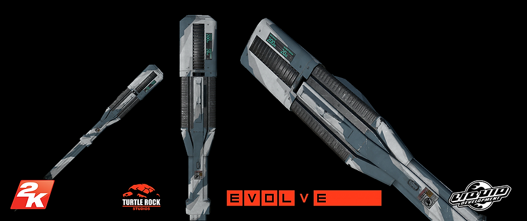

# 3D Technical Artist

## Evolve Gamed Assets

When I had the opportunity to work on Evolve, I joined a team of talented artists at Liquid Development as a 3D Technical Artist. My primary responsibility was to take skin concepts designed by concept artists and bring them to life using Physically Based Rendering (PBR).

For each assigned asset, I followed a structured three-stage development process:

- Initial Concept Application – I started by implementing the general outline of the skin, refining its shape and design.
- Material Application – I carefully applied materials, ensuring that the values and colors matched the intended look.
- Wear & Grime Pass – I added realistic wear, grime, and texture details to enhance authenticity.

Once the materials were finalized, I baked them onto the weapon models for both First-Person and Third-Person views. From there, I integrated the skins into Evolve’s CryEngine 3 game engine.

To achieve this, I utilized a combination of tools:

- 3ds Max for preparing and baking 3D models
- Photoshop & Quixel for material and texture work
- CryEngine 3 for final integration and rendering

This project was a fantastic experience that strengthened my skills in PBR workflows, material authoring, and game asset integration.

---

## Halo 5 Armor Skins

I was part of a development team dedicated to bringing concepts to life and making them look incredible—specifically, the multiplayer skins for Halo 5: Guardians!

My workflow primarily involved Photoshop and Mudbox. I started by painting masks directly onto the 3D armor models in Mudbox, ensuring the designs aligned with the original concepts. Once the initial skin was mapped out, I exported it to Photoshop for several cleanup passes. This involved refining lines and shapes, enhancing details, and assigning appropriate masking colors.

The skins were designed using a mask-based system, allowing players to customize colors for each skin dynamically, creating a more personalized multiplayer experience.

Being part of the Halo 5: Guardians development process was an incredible experience. Seeing the skins come to life in-game and knowing players could customize them made it all the more rewarding!
