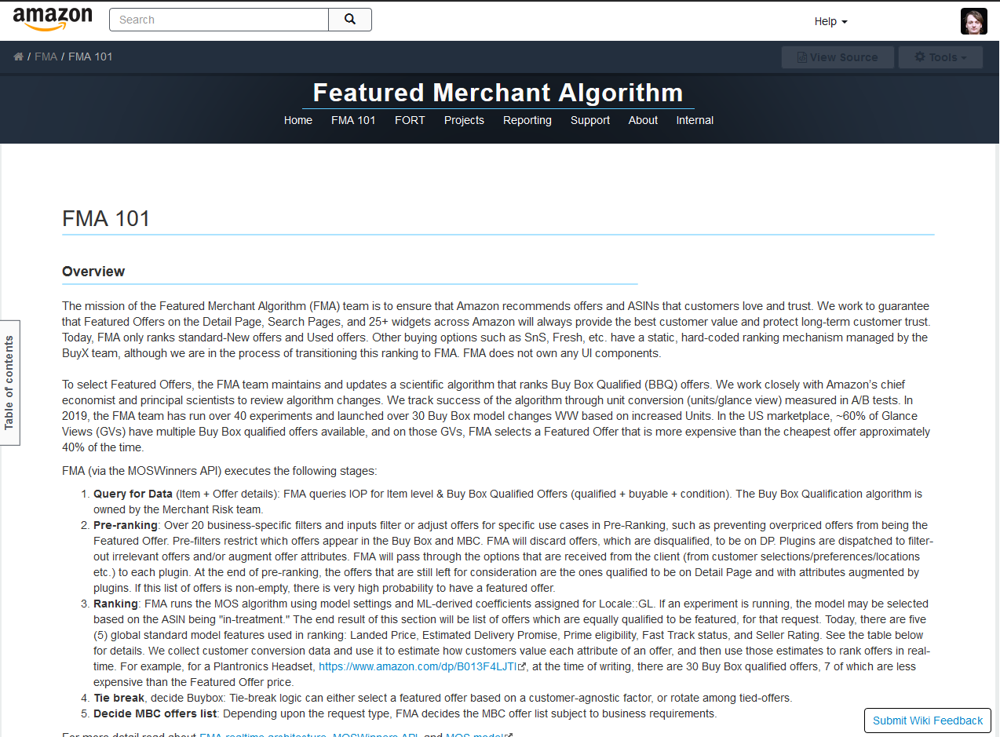
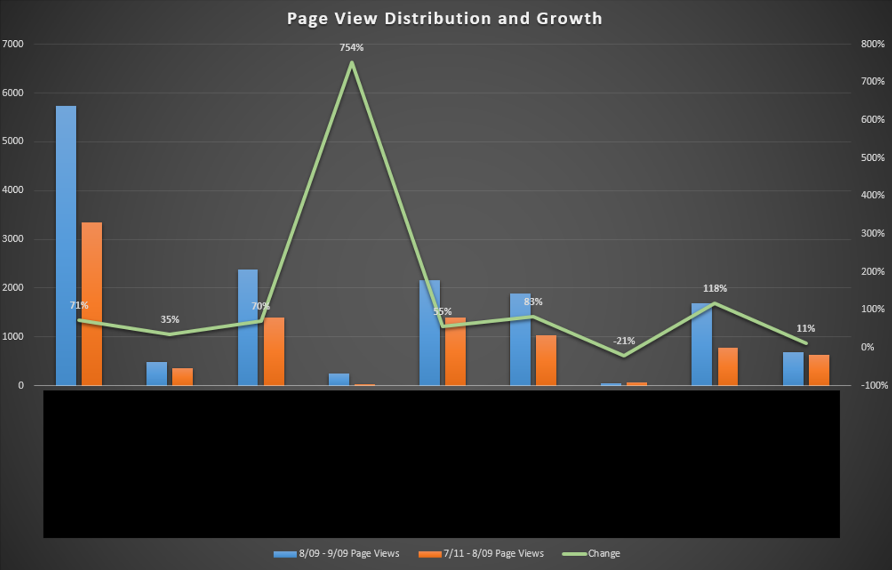

# Amazon FMA

:::tip[Skills used...]

XWiki, Markdown, HTML, CSS

:::

During my contract with Amazon’s FMA team, I led a complete overhaul of their internal wiki and documentation to improve usability for all teams relying on the FMA algorithm. Prior to my involvement, information was primarily shared through tribal knowledge, scattered links, and outdated documentation copies, making it difficult to maintain a reliable source of truth and distribute updates effectively.

I redesigned the internal wiki using Amazon’s proprietary tools, leveraging CSS to enhance usability and navigation. This restructuring significantly improved user engagement and discoverability, leading to:

- A 63% increase in site traffic within the first month post-launch.
- A 754% increase in critical page views, with unique visits rising from 28 to over 239.
- A 53% reduction in traffic to the outdated wiki, accelerating to a 90% decrease within an additional week.

To ensure long-term sustainability, I established a structured documentation pipeline, implemented internal branding improvements, and developed a roadmap for engineering and science teams to maintain future content. I also conducted instructional workshops on effective documentation practices and provided offboarding support to facilitate a smooth transition.

