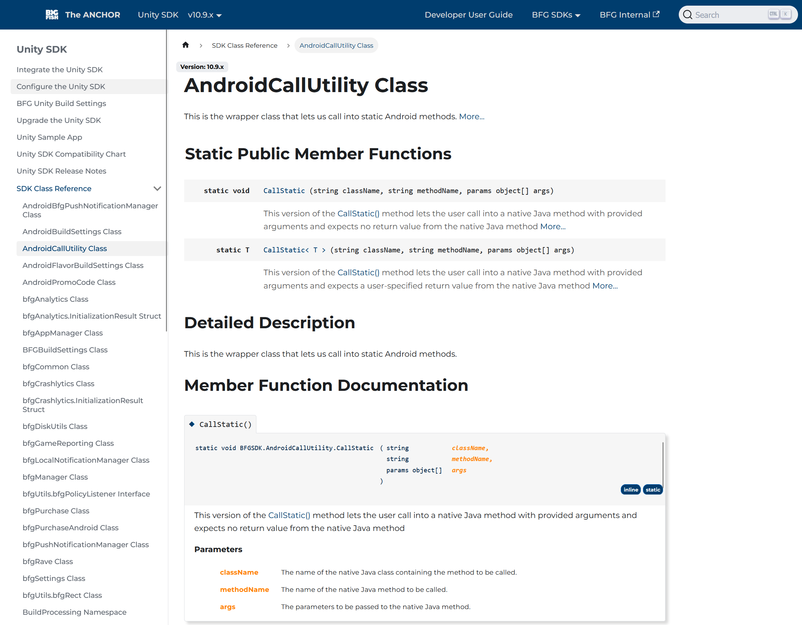

# Big Fish Games

:::tip[Skills used...]

Markdown, HTML, CSS, REACT, JavaScript, C#, JSON, Google Cloud, GitHub, Confluence, Docusaurus, Doxygen, Powershell

:::

## Summary

At Big Fish Games, I led the creation and management of SDK documentation, ensuring a seamless experience for developers integrating company tools. I developed installation guides, API references, and onboarding materials, making complex systems more accessible.

One of my key achievements was designing and implementing a Doxygen to Docusaurus automated pipeline, which streamlined SDK documentation generation and reduced manual formatting efforts by 40%. I also managed version-controlled documentation repositories (Git), ensuring content remained up-to-date with SDK releases.

Working closely with engineers, product managers, and stakeholders, I maintained detailed API references with code samples, improving developer adoption and integration. Additionally, I continuously refined documentation based on user feedback and evolving SDK features, enhancing clarity and usability.

## Doxygen to Docusaurus Pipeline

When transitioning from Confluence to Docusaurus for documentation presentation, the team faced a major challenge: Doxygen has no native support for generating SDK documentation in Markdown. Since we needed to generate SDK references for Unity, Android, and iOS SDKs, finding a workaround was critical.

Shifting to a different SDK documentation tool wasn’t an option, so I took the lead in developing a custom pipeline that processed Doxygen’s HTML output, stripping unnecessary generative tags, replacing viable HTML tags with Markdown equivalents, and fixing broken hyperlinks caused by the format change.

Beyond just conversion, I automated the entire documentation generation process for new SDK releases, ensuring each update seamlessly passed through the pipeline to produce Markdown files for GitHub and Docusaurus hosting. This effort maximized Docusaurus' capabilities, giving us greater control over the presentation and organization of our SDK references.

## Documentation at Big Fish Games

At Big Fish Games, I played a key role in developing comprehensive documentation that served developers, stakeholders, and end-users, ensuring clarity, accessibility, and efficiency in understanding key systems and processes. My work focused on technical accuracy, content strategy, and automation, making documentation a seamless part of the development workflow.

For developers, I authored detailed SDK and API documentation, integration guides, and troubleshooting resources. These materials streamlined onboarding and implementation, reducing friction and improving developer adoption.

For stakeholders, I created high-level documentation that communicated technical capabilities and system workflows in an accessible, non-technical manner. These materials helped product managers, leadership teams, and external partners make informed decisions about integrations, features, and technical roadmaps.

For end-users, I developed help articles, UI walkthroughs, and FAQs, ensuring an intuitive user experience. By collaborating with UX designers and customer support teams, I identified pain points and refined content to address common challenges, ultimately improving user engagement and reducing support overhead.

Through my work at Big Fish Games, I demonstrated my ability to bridge the gap between technical and non-technical audiences, ensuring that documentation was not just an afterthought, but a vital tool for efficiency, clarity, and product success.

---

## Additional Work Samples

For some of my work samples from Big Fish Games, please click any of the links below. You may also visit [Big Fish Games](https://docs.bigfishgames.com/) for full articles.

- [Add OneLink to Associated Domains](../../static/samples/BFG/BFG_WorkSample_01.png)
- [Add the policy listener to your game](../../static/samples/BFG/BFG_WorkSample_02.png)
- [Android Utility Class](../../static/samples/BFG/BFG_WorkSample_03.png)
- [SonarQube Code Analysis](../../static/samples/BFG/BFG_WorkSample_04.png)
- [LeanPlum Documentation](../../static/samples/BFG/BFG_WorkSample_06.png)
- [Creating Push Notifications](../../static/samples/BFG/BFG_WorkSample_07.png)
- [Telemetry Events](../../static/samples/BFG/BFG_WorkSample_08a.png)
- [Creating Custom Events with the BFG SDK](../../static/samples/BFG/BFG_WorkSample_08b.png)
