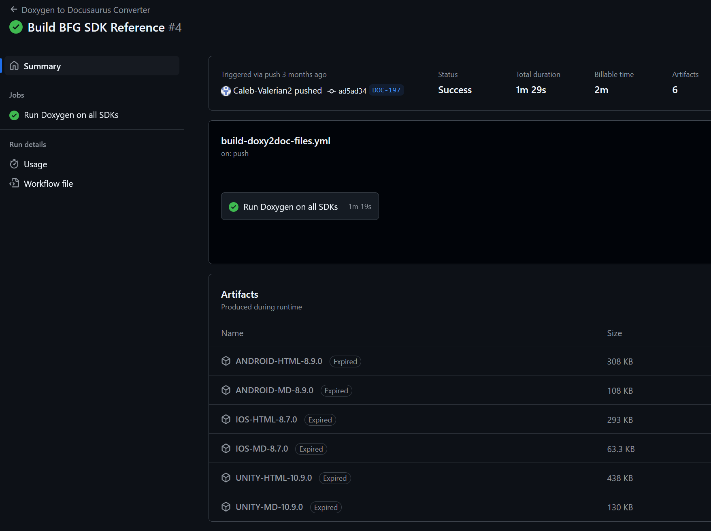
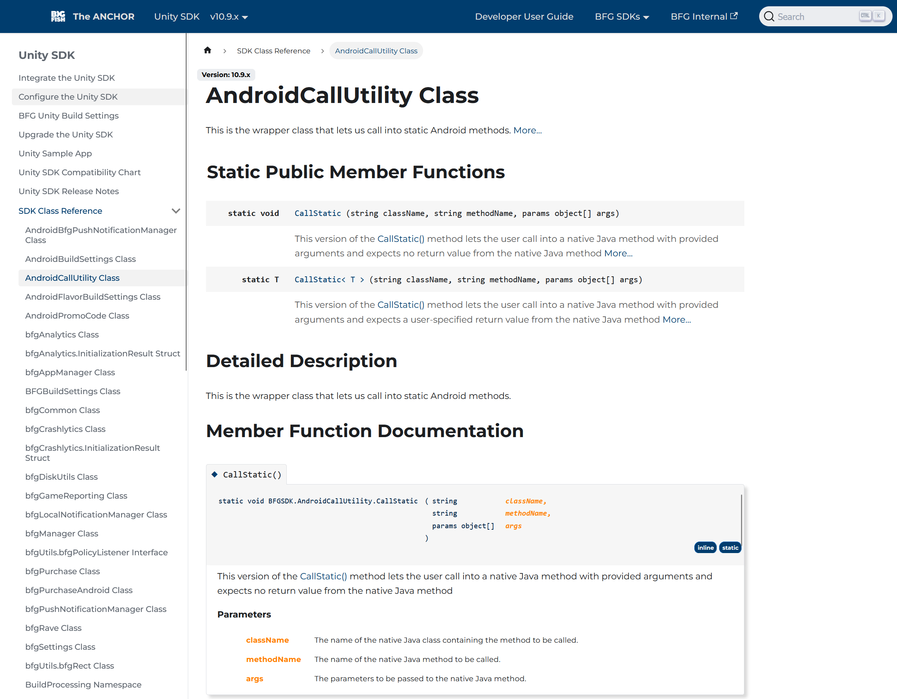

# Big Fish Games

At Big Fish Games, I led the creation and management of SDK documentation, ensuring a seamless experience for developers integrating company tools. I developed installation guides, API references, and onboarding materials, making complex systems more accessible.

One of my key achievements was designing and implementing a Doxygen to Docusaurus automated pipeline, which streamlined SDK documentation generation and reduced manual formatting efforts by 40%. I also managed version-controlled documentation repositories (Git), ensuring content remained up-to-date with SDK releases.

Working closely with engineers, product managers, and stakeholders, I maintained detailed API references with code samples, improving developer adoption and integration. Additionally, I continuously refined documentation based on user feedback and evolving SDK features, enhancing clarity and usability.

## Doxygen to Docusaurus Pipeline

<!--  -->

When transitioning from Confluence to Docusaurus for documentation presentation, the team faced a major challenge: Doxygen has no native support for generating SDK documentation in Markdown. Since we needed to generate SDK references for Unity, Android, and iOS SDKs, finding a workaround was critical.

Shifting to a different documentation tool wasn’t an option, so I took the lead in developing a custom pipeline that processed Doxygen’s HTML output, stripping unnecessary generative tags, replacing viable HTML tags with Markdown equivalents, and fixing broken hyperlinks caused by the format change.

Beyond just conversion, I automated the entire documentation generation process for new SDK releases, ensuring each update seamlessly passed through the pipeline to produce Markdown files for GitHub and Docusaurus hosting. This effort maximized Docusaurus' capabilities, giving us greater control over the presentation and organization of our SDK references.

---

For approved work samples from Unity Technologies, please click any of the links below:

:::info[Please note]

The provided work samples are approved subsections of the larger documentation.

:::

- [Add OneLink to Associated Domains](../../static/samples/BFG_WorkSample_01.png) - Sample documentation for developers using BFG SDKs.
- [Add the policy listener to your game](../../static/samples/BFG_WorkSample_02.png) - Sample documentation of adding a policy listener to developers games.
- [SonarQube Code Analysis](../../static/samples/BFG_WorkSample_03.png) - Sample of a guide in explaining what SonarQube is and how to use it.

:::tip[Skills used...]

Markdown, HTML, CSS, REACT, JavaScript, C#, JSON, Google Cloud, GitHub, Confluence, Docusaurus, Doxygen, Powershell

:::
