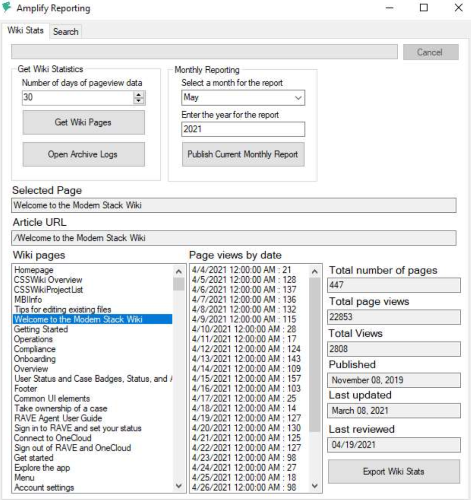

# Microsoft

:::tip[Skills used...]

C#, JSON, GitHub, Amplify

:::

## Microsoft Rave
Role: Senior Technical Writer

At Microsoft, I was part of a small team responsible for supporting documentation efforts for RAVE, a customer support tool. My primary focus was creating clear, user-friendly documentation to guide both new and existing users while also streamlining processes for documentation reporting, logging, and user engagement.

During my time on the team, I identified inefficiencies in the monthly reporting process using Amplify Reporting software. Recognizing the manual effort involved, I took the initiative to develop an automated reporting tool in .NET that generated Amplify Reports with a single click. This tool parsed the wiki by date range, retrieved relevant data, and created archival reports for historical tracking. It immediately reduced a task that normally took 8 to 16 hours into a single minute, freeing up invaluable time to improve documentation turnaround.

Beyond my core responsibilities, I expanded my documentation efforts across multiple collaborating teams, taking the lead on several projects. My proactive approach and willingness to take on additional responsibilities increased the documentation team’s reliability. As other contractors’ terms ended, I absorbed their duties, enhancing efficiency and product ownership within the team.

## Microsoft Azure Bot Team
Role: Programmer Writer

During my time at Microsoft with the FuseLabs team, I played a key role in producing and maintaining technical documentation, code samples, and developer guides for the Azure Bot Service. My work focused on updating and enhancing the online documentation to support the transition from Bot Framework SDK v3 to v4, ensuring developers had clear, accurate, and up-to-date resources.

I collaborated closely with engineers, product managers, and technical writers to identify gaps in existing documentation, debug issues, and refine content for clarity and usability. I also contributed to writing and editing API references, tutorials, and walkthroughs, making it easier for developers to build, deploy, and scale chatbot applications on Azure.

Additionally, I worked on code sample creation and debugging, ensuring that the provided examples aligned with best practices and the latest SDK changes. My contributions helped streamline the onboarding experience for developers adopting the new version of the framework, improving documentation accessibility and effectiveness.

## Microsoft Minecraft
Role: Tools Programmer

At Microsoft Minecraft, I served as a Tools Programmer, focusing on creating utilities and tools that significantly enhanced the art team's production pipeline and streamlined repetitive tasks. My work aimed to reduce manual effort and ensure efficiency, offering simple solutions with a single click. Below are a few key tools I developed:

**PNG Stripper**
This tool was designed to quickly strip out PNG metadata, specifically the unnecessary data packed by Photoshop. It rebuilt the images pixel by pixel, ensuring that only the pixel data remained. This solution resolved issues with metadata clogging existing tools, improving workflow and performance for the team.

**Texture Overlay Utility**
The Texture Overlay Utility simplified the task of applying different color variations and overlays to objects, such as potions and arrow tips. Artists could input the three essential files (Base, Overlay, and Item Type) and adjust parameters like strength and overlay type. Once satisfied, they could generate the entire set of images for all items with a single click, referencing an external config file to automate the process.

**Texture Atlas Editor**
This tool was developed to support artists in modifying texture sprite animations across multiple platforms. Given the complexity of different platform-specific animation structures, the tool eliminated the need for manual edits to Python, XML, and jQuery files. With it, artists could easily import, modify, and export texture animations for all deployed platforms, with the flexibility for future platform integrations. The robust editing features also allowed for on-the-fly adjustments.

---

## Additional Work Samples

For approved work samples from Microsoft, please click any of the links below:

- [Amplify Reporting Tool](../../static/samples/Microsoft/amplify_reporting.pdf) - Guide to instruct on the use of the created tool.
- [Rave Labor Logging User Guide](../../static/samples/Microsoft/rave_sample_01.pdf) - Guide on using RAVE for Labor Logging.
- [New File Experience in RAVE](../../static/samples/Microsoft/rave_sample_02.pdf) - Guide on RAVE file management.
- [UMT Tool Configuration](../../static/samples/Microsoft/umt_sample.pdf) - Guide on the User Management Tool for SQL servers.
