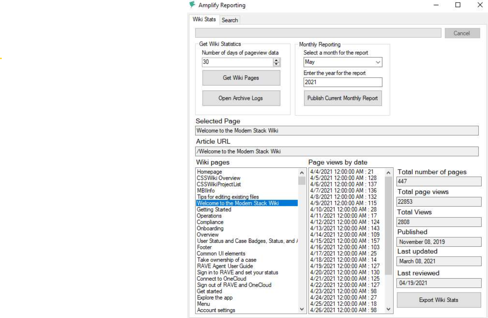

# Microsoft

At Microsoft, I was part of a small team responsible for supporting documentation efforts for RAVE, a customer support tool. My primary focus was creating clear, user-friendly documentation to guide both new and existing users while also streamlining processes for documentation reporting, logging, and user engagement.

During my time on the team, I identified inefficiencies in the monthly reporting process using Amplify Reporting software. Recognizing the manual effort involved, I took the initiative to develop an automated reporting tool in .NET that generated Amplify Reports with a single click. This tool parsed the wiki by date range, retrieved relevant data, and created archival reports for historical tracking. It immediately reduced a task that normally took 8 to 16 hours into a single minute, freeing up invaluable time to improve documentation turnaround.

Beyond my core responsibilities, I expanded my documentation efforts across multiple collaborating teams, taking the lead on several projects. My proactive approach and willingness to take on additional responsibilities increased the documentation team’s reliability. As other contractors’ terms ended, I absorbed their duties, enhancing efficiency and product ownership within the team.

For approved work samples from Microsoft, please click any of the links below:

- [Amplify Reporting Tool](../../static/samples/amplify_reporting.pdf) - Guide to instruct on the use of the created tool.
- [Rave Labor Logging User Guide](../../static/samples/rave_sample_01.pdf) - Guide on using RAVE for Labor Logging.
- [New File Experience in RAVE](../../static/samples/rave_sample_02.pdf) - Guide on RAVE file management.
- [UMT Tool Configuration](../../static/samples/umt_sample.pdf) - Guide on the User Management Tool for SQL servers.

:::tip[Skills used...]

C#, JSON, GitHub, Amplify

:::
