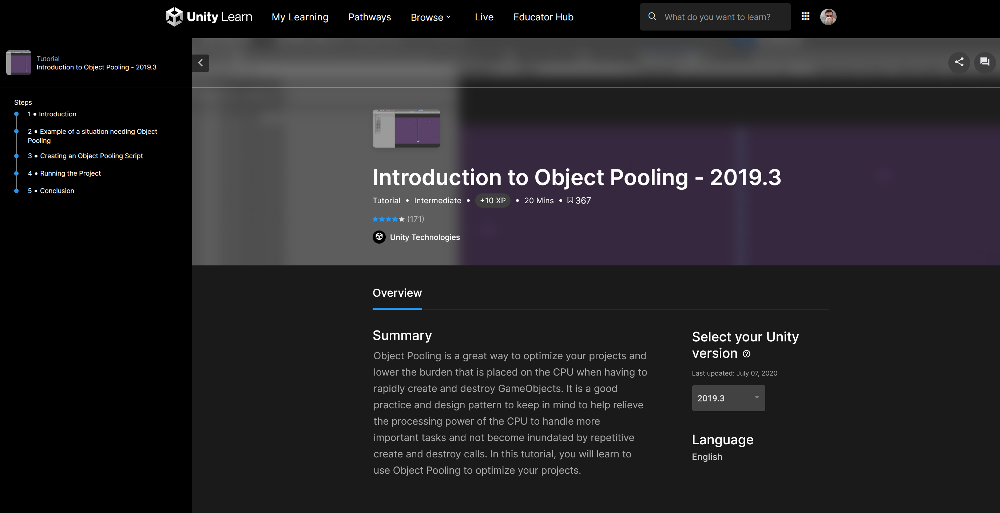

# Unity Technologies

:::tip[Skills used...]

Unity 3D, C#, Adobe After Effects, Adobe Premiere, OBS

:::

## Summary

At Unity, I played a key role in developing comprehensive documentation and learning materials for the [Unity Learn](https://learn.unity.com/) platform, helping developers effectively use the Unity engine. I authored 231 guides covering both emerging and existing Unity3D features, created 32 video tutorials for certification courses, and contributed to maintaining and updating existing documentation.

Leveraging my experience as a Unity 3D developer, programmer, and technical writer, I became a critical asset to the team, ensuring that instructional content was both technically accurate and easy to understand. In addition to authoring and managing documentation, I helped streamline documentation workflows, designing a new template that reduced review loops and writing C# gameplay scripts to supplement step-by-step guides.

Working closely with engineers, designers, and educators, I ensured that Unity’s documentation was clear, accessible, and developer-friendly.

---

## List of Guides & Tutorials

All my work can be found on the Unity Learn platform for free! Here is a non-exhaustive list of some of the work I contributed to Unity:

Workshops:

 - Slot Machine Art and Engineering in Unity
 - Unity Animation Studios
 - Digital Design Group
 - Intro to Automotive Design & Visualization
 - Intro to Storytelling
 - Migrating to 2018.2
 - Special Subjects in Unity
 - Product Madness

Video Courses (Sample List):

- Creating UI Elements & Layouts (Buttons, Worldspace UI, Overlays)
- Working with TextMesh Pro
- Static & Dynamic Canvas Techniques

Technical Documentation & Workflows (Partial List):

- 2D & Sprite Tools: Tilemap, Sprite Editor, Layer Editor, Sprite Masks
- Rendering & Lighting: HDRP/LWRP, Post Processing, Lightmaps, Shadergraph Basics
- Optimization & Debugging: Profiler, Stats Window, Frame Debugger, Gameplay Optimization
- Timeline & Animation: Cinemachine, Activation Tracks, Keyframed Animation
- 3D Asset Workflows: Retopology, LODs, Baking Maps in 3ds Max

...And much more!

---

## Additional Work Samples

:::info[Please note]

The provided work samples are approved subsections of the larger documentation. But all full works can be found published for free on Unity Learn!

:::

**Sample Raw Documentation**
- [Object Pooling](../../static/samples/unity_learn_01.pdf) - Tutorial in creating object pooling within Unity 3D.
- [Profiler Window](../../static/samples/unity_learn_02.pdf) - Explanation of Unity 3D's profiling window and how to use it.
- [Introduction to LWRP](../../static/samples/unity_learn_03.pdf) - An introduction to the Lightweight Rendering Pipeline.

**Sample Published Unity Learn Tutorials**
- [Introduction to Object Pooling](https://learn.unity.com/tutorial/introduction-to-object-pooling)
- [The PiXYZ Studio Interface](https://learn.unity.com/tutorial/the-pixyz-studio-interface)
- [Setting up Bounced Indirect Lighting in HDRP](https://learn.unity.com/tutorial/setting-up-bounced-indirect-lighting-in-hdrp#)
