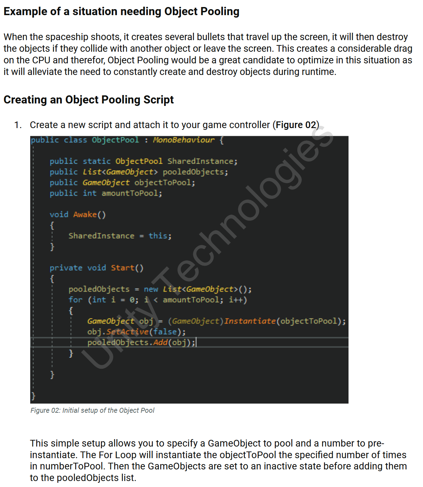

# Unity Technologies

:::tip[Skills used...]

Unity 3D, C#, Adobe After Effects, Adobe Premiere, OBS

:::

At Unity, I played a key role in developing comprehensive documentation and learning materials for the Unity Learn platform, helping developers effectively use the Unity engine. I authored 231 guides covering both emerging and existing Unity3D features, created 32 video tutorials for certification courses, and contributed to maintaining and updating existing documentation.

Leveraging my experience as a Unity 3D developer, programmer, and technical writer, I became a critical asset to the team, ensuring that instructional content was both technically accurate and easy to understand. In addition to authoring and managing documentation, I helped streamline documentation workflows, designing a new template that reduced review loops and writing C# gameplay scripts to supplement step-by-step guides.

Working closely with engineers, designers, and educators, I ensured that Unity’s documentation was clear, accessible, and developer-friendly.

---

## Additional Work Samples

For approved work samples from Unity Technologies, please click any of the links below:

:::info[Please note]

The provided work samples are approved subsections of the larger documentation.

:::

- [Object Pooling](../../static/samples/unity_learn_01.pdf) - Tutorial in creating object pooling within Unity 3D.
- [Profiler Window](../../static/samples/unity_learn_02.pdf) - Explanation of Unity 3D's profiling window and how to use it.
- [Introduction to LWRP](../../static/samples/unity_learn_03.pdf) - An introduction to the Lightweight Rendering Pipeline.
